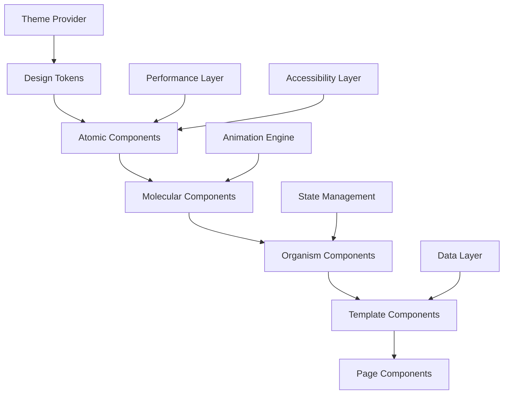
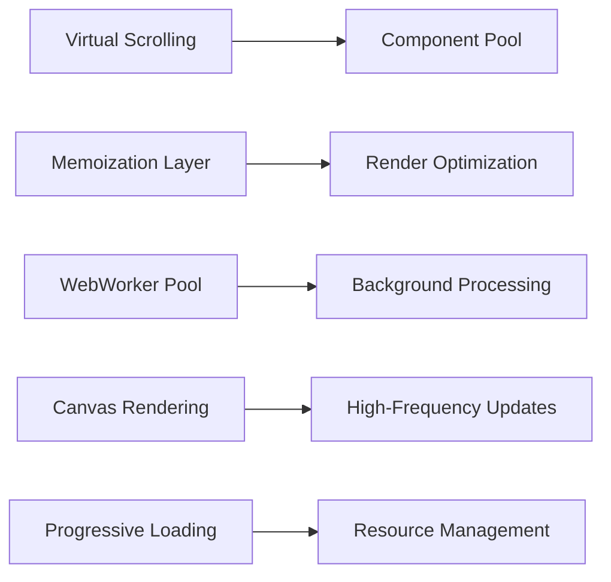

# Superior UI Design System - Design Document

## Overview

The Superior UI Design System creates a professional-grade trading interface that combines modern web technologies with proven design patterns from industry leaders like TradingView and Walbi. The system implements a component-driven architecture with atomic design principles, advanced performance optimizations, and comprehensive accessibility support.

## Architecture

### Design System Architecture



### Component Hierarchy

1. **Design Tokens**: Colors, typography, spacing, shadows, animations
2. **Atoms**: Buttons, inputs, icons, labels, indicators
3. **Molecules**: Form groups, card headers, navigation items, chart controls
4. **Organisms**: Charts, order books, dashboards, navigation bars
5. **Templates**: Page layouts, modal structures, responsive grids
6. **Pages**: Complete trading interfaces, settings pages, analytics views

### Performance Architecture



## Components and Interfaces

### Core Design System Components

#### 1. Theme Provider
```typescript
interface ThemeConfig {
  colors: ColorPalette;
  typography: TypographyScale;
  spacing: SpacingScale;
  shadows: ShadowScale;
  animations: AnimationConfig;
  breakpoints: BreakpointConfig;
}

interface ColorPalette {
  primary: ColorScale;
  secondary: ColorScale;
  success: ColorScale;
  warning: ColorScale;
  error: ColorScale;
  neutral: ColorScale;
  trading: TradingColors;
}

interface TradingColors {
  bullish: string;
  bearish: string;
  neutral: string;
  volume: string;
  spread: string;
}
```

#### 2. Advanced Chart Component
```typescript
interface ChartComponent {
  data: CandlestickData[];
  indicators: TechnicalIndicator[];
  overlays: ChartOverlay[];
  timeframe: TimeframeConfig;
  style: ChartStyleConfig;
  performance: PerformanceConfig;
}

interface PerformanceConfig {
  virtualScrolling: boolean;
  canvasRendering: boolean;
  updateThrottling: number;
  memoryManagement: boolean;
}
```

#### 3. Order Book Visualization
```typescript
interface OrderBookComponent {
  bids: OrderLevel[];
  asks: OrderLevel[];
  spread: SpreadInfo;
  depth: number;
  aggregation: AggregationLevel;
  animations: OrderBookAnimations;
}

interface OrderBookAnimations {
  priceFlash: AnimationConfig;
  sizeChange: AnimationConfig;
  newOrder: AnimationConfig;
  orderRemoval: AnimationConfig;
}
```

#### 4. Dashboard Widget System
```typescript
interface WidgetSystem {
  layout: GridLayout;
  widgets: Widget[];
  persistence: LayoutPersistence;
  dragDrop: DragDropConfig;
}

interface Widget {
  id: string;
  type: WidgetType;
  position: GridPosition;
  size: GridSize;
  config: WidgetConfig;
  data: WidgetData;
}
```

### Advanced UI Patterns

#### 1. Glassmorphism Implementation
- **Background**: Semi-transparent surfaces with backdrop blur
- **Borders**: Subtle gradients with opacity variations
- **Shadows**: Multi-layered shadows for depth perception
- **Animations**: Smooth transitions with easing functions

#### 2. Micro-interactions
- **Hover States**: Subtle scale and color transitions
- **Click Feedback**: Ripple effects and state changes
- **Loading States**: Skeleton screens and progress indicators
- **Data Updates**: Smooth value transitions and highlighting

#### 3. Responsive Grid System
- **Breakpoints**: Mobile-first approach with 5 breakpoints
- **Flexible Layouts**: CSS Grid with fallback to Flexbox
- **Component Adaptation**: Automatic layout adjustments
- **Performance**: Optimized re-renders on resize

## Data Models

### Design Token Structure
```typescript
interface DesignTokens {
  color: {
    primary: {
      50: string;
      100: string;
      // ... through 900
    };
    semantic: {
      success: string;
      warning: string;
      error: string;
      info: string;
    };
    trading: {
      bull: string;
      bear: string;
      neutral: string;
    };
  };
  
  typography: {
    fontFamily: {
      primary: string;
      monospace: string;
    };
    fontSize: {
      xs: string;
      sm: string;
      // ... through 4xl
    };
    fontWeight: {
      light: number;
      normal: number;
      medium: number;
      semibold: number;
      bold: number;
    };
  };
  
  spacing: {
    0: string;
    1: string;
    // ... through 96
  };
  
  animation: {
    duration: {
      fast: string;
      normal: string;
      slow: string;
    };
    easing: {
      linear: string;
      easeIn: string;
      easeOut: string;
      easeInOut: string;
    };
  };
}
```

### Component State Models
```typescript
interface ComponentState {
  loading: boolean;
  error: Error | null;
  data: any;
  interactions: InteractionState;
  performance: PerformanceMetrics;
}

interface InteractionState {
  hover: boolean;
  focus: boolean;
  active: boolean;
  disabled: boolean;
}

interface PerformanceMetrics {
  renderTime: number;
  updateFrequency: number;
  memoryUsage: number;
  frameRate: number;
}
```

## Error Handling

### Error Boundary Strategy
```typescript
interface ErrorBoundaryConfig {
  fallbackComponent: React.ComponentType;
  errorReporting: ErrorReportingConfig;
  recovery: RecoveryStrategy;
  logging: LoggingConfig;
}

interface RecoveryStrategy {
  autoRetry: boolean;
  retryAttempts: number;
  fallbackMode: boolean;
  gracefulDegradation: boolean;
}
```

### Error Types and Handling
1. **Rendering Errors**: Component-level error boundaries
2. **Data Loading Errors**: Retry mechanisms with exponential backoff
3. **Performance Errors**: Automatic fallback to simpler rendering modes
4. **Network Errors**: Offline mode and cached data fallbacks
5. **Accessibility Errors**: Alternative interaction methods

## Testing Strategy

### Component Testing Approach
```typescript
interface TestingStrategy {
  unit: UnitTestConfig;
  integration: IntegrationTestConfig;
  visual: VisualTestConfig;
  performance: PerformanceTestConfig;
  accessibility: A11yTestConfig;
}

interface VisualTestConfig {
  screenshotTesting: boolean;
  crossBrowserTesting: boolean;
  responsiveTesting: boolean;
  themeVariationTesting: boolean;
}

interface PerformanceTestConfig {
  renderPerformance: boolean;
  memoryLeakDetection: boolean;
  animationPerformance: boolean;
  dataUpdatePerformance: boolean;
}
```

### Testing Pyramid
1. **Unit Tests**: Individual component functionality
2. **Integration Tests**: Component interaction and data flow
3. **Visual Regression Tests**: UI consistency across changes
4. **Performance Tests**: Rendering speed and memory usage
5. **Accessibility Tests**: Screen reader and keyboard navigation
6. **Cross-browser Tests**: Compatibility across major browsers

## Implementation Architecture

### Technology Stack
- **React 18**: Concurrent features and Suspense
- **TypeScript**: Type safety and developer experience
- **Styled Components**: CSS-in-JS with theme support
- **Framer Motion**: Advanced animations and gestures
- **React Virtual**: High-performance list virtualization
- **Canvas API**: High-frequency chart rendering
- **Web Workers**: Background processing for heavy computations

### Performance Optimizations
1. **Virtual Scrolling**: For large datasets (order books, trade history)
2. **Canvas Rendering**: For high-frequency chart updates
3. **Memoization**: React.memo and useMemo for expensive calculations
4. **Code Splitting**: Lazy loading of non-critical components
5. **Resource Preloading**: Critical assets loaded in advance
6. **Service Workers**: Caching and offline functionality

### Accessibility Implementation
1. **ARIA Labels**: Comprehensive labeling for screen readers
2. **Keyboard Navigation**: Full keyboard accessibility
3. **Focus Management**: Logical focus order and visible indicators
4. **Color Contrast**: WCAG AA compliance for all text
5. **Motion Preferences**: Respect for reduced motion settings
6. **Alternative Formats**: Text alternatives for visual information

### Mobile Optimization
1. **Touch Interactions**: Optimized touch targets and gestures
2. **Responsive Breakpoints**: Mobile-first design approach
3. **Performance**: Reduced animations and simplified layouts
4. **Offline Support**: Critical functionality available offline
5. **Progressive Web App**: App-like experience on mobile devices

This design provides a comprehensive foundation for building a superior UI that rivals professional trading platforms while maintaining excellent performance, accessibility, and user experience.